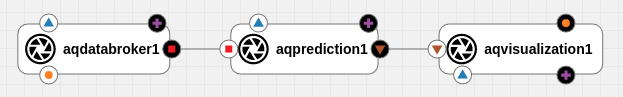

# Air Quality Prediction and Visualization Pipeline

The air quality prediction and visualization pipeline is a use case scenario developed for the [AI4EU Experiments platform](https://aiexp.ai4europe.eu/#/home). It consists of three different modules, the databroker module, the prediction module and the visualization module.  

The `databroker` module simulates data fetching from a database with microsensor data through API calls by utilizing a static csv file with historical data. The data are provided by 23 microsensors that are spread around the city of Trondheim in order to monitor air quality.  

The `prediction` module is based on a random forest regressor that is trained on historical data from the aformentioned microsensors and predicts 3 different air pollutant values, NO2, PM10 and PM2.5, for a user specified location in the area of Trondheim. For our use case scenario, we forecast the pollutant values for the locations where the microsensors are placed, thus, implicitly utilizing our model as a calibration tool for the microsensors.  

The `visualization` module implements a web interface to visually analyze the level of pollutants for the area around each microsensors through a map visualization, a pairwise correlation network and three temporal plot lines for the pollutant values.  

All modules are provided as docker containers and implement the gRPC protocol for their communication. A local orchestrator solution is provided for testing purposes as an alternative to the generic orchestrator produced by the `AI4EU Experiments platform`. 

# Pipeline

# Component description

## Databroker
The [Data Source](docs/data-source.md) component serves as an aggregator of data incoming from different services, and which is useful for the AI4IoT pipeline. In particular, it connects to external APIs and provides data in an unified (and standardized through protobuf message definition) way.
The AI4IoT tackles air quality in the city of Trondheim, Norway. Therefore, the current version of this component fetches data for this city. The structure can, however, be replicated to any other place by extending the scripts with the given API calls for the place of interest.
Currently, available data through this component is pollution measurements both from a network of low-cost sensors, a (much smaller) network of industrial sensors and meteorological data.

## Prediction
The [Calibration](docs/calibration.md) component is part of the AI4IoT pipeline. It implements a machine learning model that calibrates data coming from low-cost sensors, such that the output is as close as possible to reference values. The component is deployed with a pre-trained model and outputs the calibrated values for PM2.5 and PM10 measurements. Inputs are PM measurements from the sensor and meteorological data.

## Visualization
The [Visualization](docs/visualization.md) component implements a simple web interface which presents historical data (for the past 12 hours) of the raw data from a low-cost sensor and the calibrated values.

# Deployment

This repository documents three possible alternatives for the deployment of this pipeline. First we describe the procedure to deploy locally with docker and manual orchestration (i.e., a script written just for this particular case). Here there are two sub-alternatives, either to build the containers locally from the source code or pull from [Docker Hub](https://hub.docker.com), although the latter is recommended. Finally, the deployment process through the AI4EU Experiments platform (which is based on the Acumos platform) is documented. The following links lead to documentation for each of the alternatives.

## Local Deployment

[Local deployment with docker containers built locally](docs/docker-local.md)

[Local deployment with docker containers pulled from Docker Hub](docs/docker-hub.md)

## Deployment with AI4EU Experiments Platform (ACUMOS)

[Deployment through the AI4EU Experiments platform](docs/acumos.md)