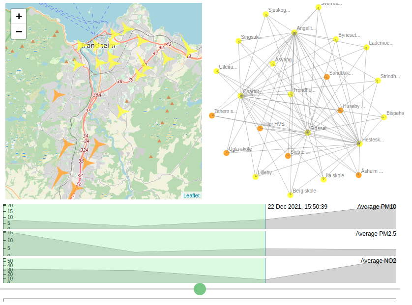

# Air Quality Prediction and Visualization Pipeline

The air quality prediction and visualization pipeline is a use case scenario developed for the [AI4EU Experiments platform](https://aiexp.ai4europe.eu/#/home). It consists of three different modules, the databroker module, the prediction module and the visualization module.  

The `databroker` module simulates data fetching from a database with microsensor data through API calls by utilizing a static csv file with historical data. The data are provided by 23 microsensors that are spread around the city of Trondheim in order to monitor air quality.  

The `prediction` module is based on a random forest regressor that is trained on historical data from the aformentioned microsensors and predicts 3 different air pollutant values, NO2, PM10 and PM2.5, for a user specified location in the area of Trondheim. For our use case scenario, we forecast the pollutant values for the locations where the microsensors are placed, thus, implicitly utilizing our model as a calibration tool for the microsensors.  

The `visualization` module implements a web interface to visually analyze the level of pollutants for the area around each microsensors through a map visualization, a pairwise correlation network and three temporal plot lines for the pollutant values.  

All modules are provided as docker containers and implement the gRPC protocol for their communication. A local orchestrator solution is provided for testing purposes as an alternative to the generic orchestrator produced by the `AI4EU Experiments platform`. 

# Deployment

There are two possible ways to deploy the pipeline, locally through the use of the local orchestrator provided and through the AI4EU Experiments platform. The later allows for both local and cloud deployment. In the AI4EU platform, a developer can design a pipeline with different modules available in the marketplace in Design Studio application. Next, you validate the final pipeline design and deploy it to the platform of your choice(ex. Google Cloud Platform, Microsoft Azure, kubernetes, local etc.). The final pipeline is depicted in the picture.


## Local Deployment

This repository documents three possible alternatives for the deployment of this pipeline. First we describe the procedure to deploy locally with docker and manual orchestration (i.e., a script written just for this particular case). Here there are two sub-alternatives, either to build the containers locally from the source code or pull from [Docker Hub](https://hub.docker.com), although the latter is recommended. Finally, the deployment process through the AI4EU Experiments platform (which is based on the Acumos platform) is documented. The following links lead to documentation for each of the alternatives.

## Local Deployment

For the local deployment we need to run each module server in a separate terminal window using the following commands:

### first terminal window
```
cd databroker
pip install -r requirements.txt
python3 databroker.py
```
### second terminal window
```
cd prediction_model
pip install -r requirements.txt
python3 prediction.py
```
### third terminal window
```
cd visualization
pip install -r requirements.txt
python3 visualization.py
```
### fourth terminal window
cd local_orchestrator
pip install -r requirements.txt
python3 local_orchestrator.py

### output
The flask server on the visualization terminal will return an ip address on port 8064 that we can open in our we browser by visiting http://localhost:8064
The visualization web interface can be seen in the picture.



## Deployment with AI4EU Experiments Platform
